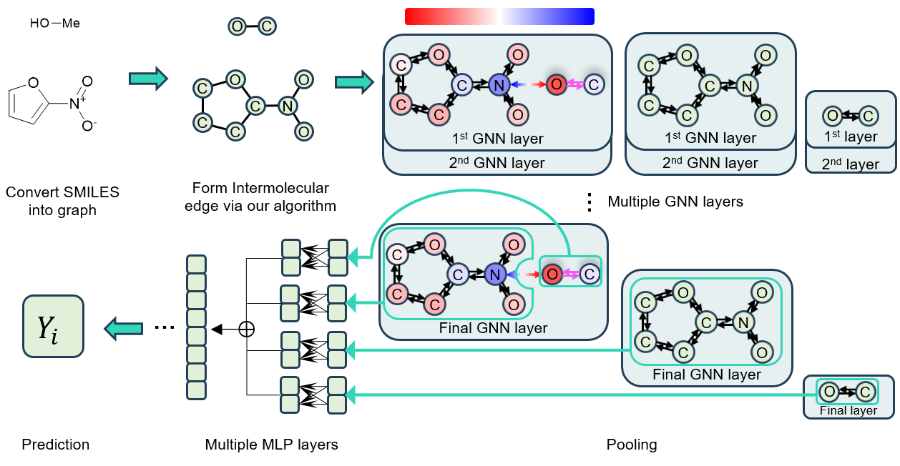

# Revealing the Impact of Aggregations in the Graph-based Molecular Machine Learning: Electrostatic Interaction versus Pooling Methods
***

- **https://doi.org/10.26434/chemrxiv-2024-sbwxm**

### Repository for electrostatic edge linked Graph Convolution Network (eelGCN) and Graph Convolution Network (GCN)

***

### Type below command to generate new environment

>1. conda create -n eel_gnn python=3.11
>1. conda activate eel_gnn
>1. conda install pytorch==2.0.1 torchvision==0.15.2 torchaudio==2.0.2 pytorch-cuda=11.7 -c pytorch -c nvidia
>1. pip install torch_scatter torch_sparse torch_cluster torch_spline_conv torch-geometric -f https://data.pyg.org/whl/torch-2.0.1+cu117.html
>1. conda install pandas
>1. pip install -U scikit-learn
>1. pip install rdkit
>1. conda install openpyxl

### In addition, below command is required for $\mathrm{eelGCN_{E}}$'s implementation

>8. conda install -c dglteam/label/th20_cu117 dgl
>9. pip install espaloma_charge
>10. pip install packaging
***

## Requirements for CUDA.version <= 11.7 (or for whom above does not work)

### You can install older packages using below commands

>1. conda create -n alt_env python=3.10
>1. conda activate alt_env
>1. conda install pytorch==1.13.1 torchvision torchaudio pytorch-cuda=11.7 -c pytorch -c nvidia
>1. pip install torch-scatter torch-sparse torch-cluster torch-spline-conv torch-geometric -f https://data.pyg.org/whl/torch-1.13.1+cu117.html
>1. conda install pandas
>1. pip install -U scikit-learn
>1. pip install rdkit
>1. conda install openpyxl

### $\mathrm{eelGNN_{E}}$ is not directly available in this case.

This is because $\mathrm{eelGCN_{E}}$ supports python >= 3.11, and python of this version doesn't support CUDA.version <= 11.7

#### Still, $\mathrm{eelGCN_{E}}$ could be implement by using below secondhand method.
> - Create other environment with python=3.11
> - Install Espaloma charge
> - Generate the pickle file which contains Espaloma charge information
> - Activate alt_env and use generated pickle file for $\mathrm{eelGCN_{E}}$'s implementation

***
## Code execution

### 1. Calculate partial charge of molecules and save charge data as a pkl file. This procedure is not required for $\mathrm{eelGCN_{P}}$.
### run `./utils/partial_charge.py` (alg = 'espaloma' or 'gasteiger')
#### This procedure can be skipped because the charge of chromophore data is prepared in both espaloma and gasteiger charge.

### 2. Determine the set of number as following

> i) Which property do you want to predict?
> 1. maximum absorption wavelength [$\mathrm{nm}$]
> 2. maximum emission wavelength [$\mathrm{nm}$]
> 3. fluorescence lifetime ($\log_{10}$ value)
> 4. photoluminescence quantum yield ($\log_{10}$ value)
> 5. extinction coefficient ($\log_{10}$ value)
> 6. absorption bandwidth [$\mathrm{cm^{-1}}$]
> 7.  emission bandwidth [$\mathrm{cm^{-1}}$]
> 8. solubility (ESOL)
> 9. molar mass (ESOL)

> ii) Which model do you want to use?
> 1. $\mathrm{eelGCN_{E}}$
> 1. $\mathrm{eelGCN_{G}}$
> 1. $\mathrm{eelGCN_{P}}$
> 1. $\mathrm{GCN}$

> iii) How many edge types do you want for intermolecular edges?
> 1. 1
> 2. 2
> 3. 4

> iv) Which aggregation function do you want to use?
> 1. add
> 2. mean

> v) Which pooling function do you want to use?
> 1. add
> 2. mean

### 3. Run `./main.py` with the pre-determined set of number

#### For example, you can type the following command. 

#### **`python main.py 5 2 1 2 1`**

#### to predict extinction coefficient with $\mathrm{eelGCN_{G}}$, using single intermolecular edge types and using mean aggregation and add pooling.
